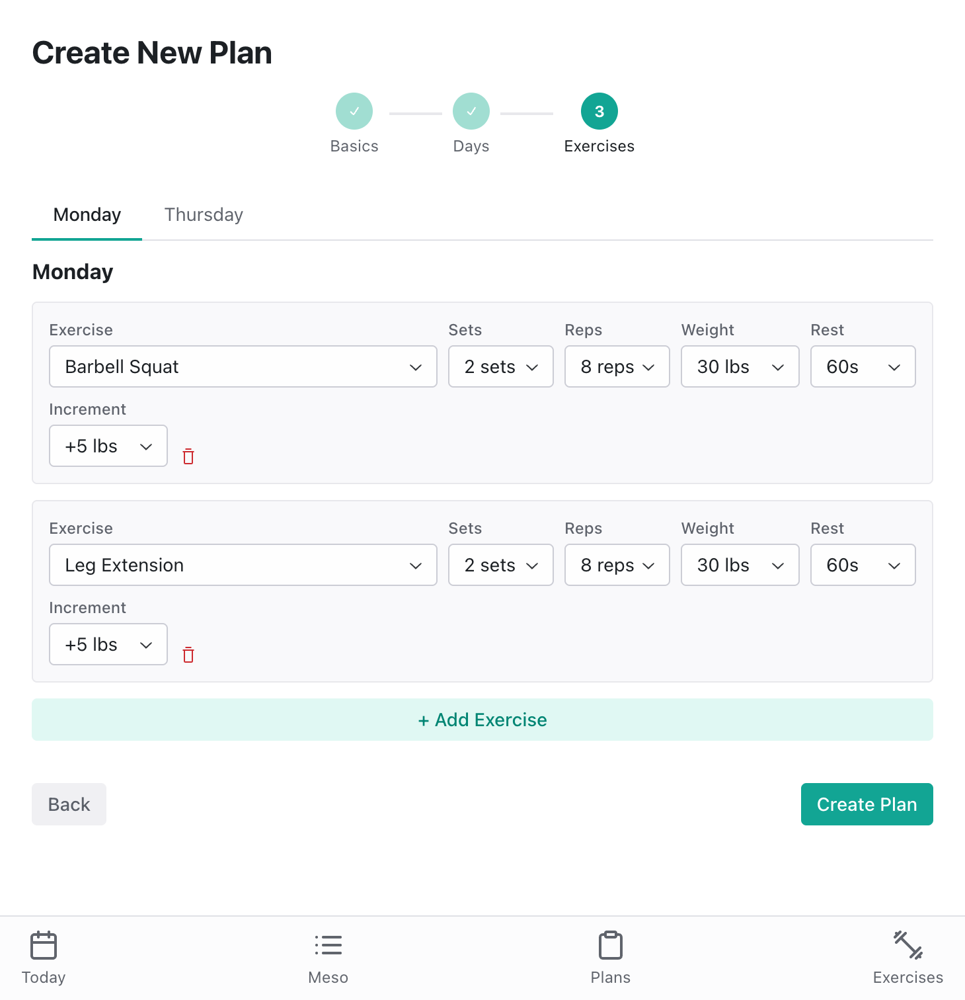

# Lifting - Workout Tracker

A single-user weight training workout tracker with progressive overload.

## Features

### Workout Tracker
Track your workouts with an intuitive interface. Log sets, adjust weights and reps on the fly, and mark exercises complete as you go.


### Plan Creator
Build custom workout plans with a step-by-step wizard. Configure exercises with sets, reps, starting weight, rest periods, and progressive overload increments.



## Development

```bash
npm install              # Install dependencies
npm run dev              # Start client (3000) + server (3001)
npm run test             # Run unit tests
npm run lint             # Run ESLint
npm run typecheck        # TypeScript check
npm run build            # Build all packages
```

## Docker

```bash
npm run docker:dev       # Development environment
npm run docker:down      # Stop containers
```

## Structure

- `packages/shared` - Shared types/utilities
- `packages/server` - Express API + SQLite
- `packages/client` - React + Radix UI
- `e2e` - Playwright E2E tests

## Deployment

Deploy to a remote Linux server via rsync over SSH.

### First-time setup (optional)

```bash
./scripts/setup-server.sh   # Install Node.js 20 if not present
```

### Deploy

```bash
./scripts/deploy.sh              # Full deploy (build + sync + restart)
./scripts/deploy.sh --skip-build # Skip local build
./scripts/deploy.sh --skip-install # Skip npm install on remote
./scripts/deploy.sh --dry-run    # Preview without transferring
```

### Server management

```bash
ssh linux-machine 'tail -f ~/lifting/lifting.log'                    # View logs
ssh linux-machine 'pkill -f "node.*lifting.*index.js"'               # Stop server
ssh linux-machine 'cd ~/lifting && NODE_ENV=production node packages/server/dist/index.js'  # Start manually
```

The app runs at `http://linux-machine:3000`. Database is created automatically at `~/lifting/packages/server/data/lifting.prod.db`.

### Configuration

Edit `scripts/deploy.sh` to change:
- `REMOTE_HOST` - SSH host alias (default: `linux-machine`)
- `REMOTE_DIR` - Install location (default: `~/lifting`)
