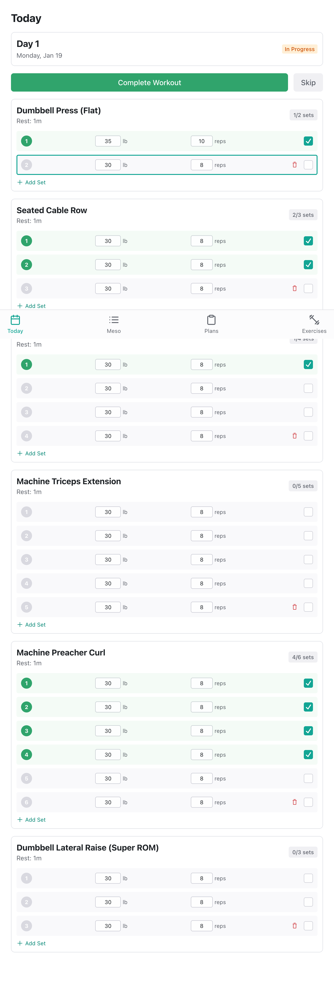

# brad-os

A personal operating system for tracking wellness and fitness. Built as a learning project that I actually use daily. Currently focused on workouts, stretching, and meditation—will expand as needed.

## Screenshots

| Today | Workout | Calendar |
|-------|---------|----------|
|  |  |  |

## Features

- **Workout Plans**: Build custom plans with exercises, sets, reps, and rest periods
- **Progressive Overload**: Automatic weight/rep progression across 6-week mesocycles
- **Stretch Routines**: Guided stretching sessions by body region
- **Meditation Timer**: Simple meditation with configurable duration
- **Activity Calendar**: Track all activities with visual history

## Development

```bash
npm install              # Install dependencies
npm run dev              # Start client (3000) + server (3001)
npm run validate         # Run all checks (lint, types, tests)
npm run build            # Build all packages
```

## Structure

- `packages/shared` - Shared types/schemas
- `packages/server` - Express API + SQLite
- `packages/client` - React + Radix UI
- `e2e` - Playwright E2E tests

## Deployment

```bash
./scripts/deploy.sh      # Build + deploy to remote server
```
