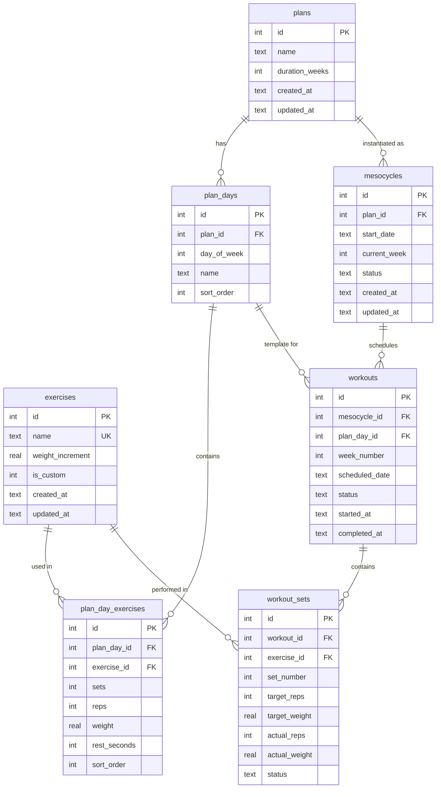

# Phase 2: Database & Backend Foundation (TDD)

## Overview

This phase establishes the SQLite database schema, implements repositories using Test-Driven Development (TDD), creates a migration system, seeds default exercises, and sets up the Express foundation with proper error handling and validation.

---

## Table of Contents

1. [Database Schema Design](#1-database-schema-design)
2. [Shared TypeScript Types](#2-shared-typescript-types)
3. [TDD Implementation Order](#3-tdd-implementation-order)
4. [Migration System](#4-migration-system)
5. [Repository Implementation](#5-repository-implementation)
6. [Seed Data](#6-seed-data)
7. [Express Foundation](#7-express-foundation)
8. [File Structure](#8-file-structure)
9. [Success Criteria](#9-success-criteria)
10. [Commit Message](#10-commit-message)

---

## 1. Database Schema Design

### 1.1 Entity Relationship Diagram (Conceptual)

```
exercises ─────────────────┐
                           │
plans ──┬── plan_days ──┬──┴── plan_day_exercises
        │               │
        └── mesocycles ─┴── workouts ── workout_sets
```

### 1.2 Table Definitions

#### `exercises`

Stores all available exercises (both default and custom).

| Column           | Type    | Constraints               | Default           | Description                            |
| ---------------- | ------- | ------------------------- | ----------------- | -------------------------------------- |
| id               | INTEGER | PRIMARY KEY AUTOINCREMENT | -                 | Unique identifier                      |
| name             | TEXT    | NOT NULL UNIQUE           | -                 | Exercise name                          |
| weight_increment | REAL    | NOT NULL                  | 5.0               | Weight to add during progression (lbs) |
| is_custom        | INTEGER | NOT NULL                  | 0                 | 0=default, 1=user-created              |
| created_at       | TEXT    | NOT NULL                  | CURRENT_TIMESTAMP | ISO 8601 timestamp                     |
| updated_at       | TEXT    | NOT NULL                  | CURRENT_TIMESTAMP | ISO 8601 timestamp                     |

```sql
CREATE TABLE exercises (
    id INTEGER PRIMARY KEY AUTOINCREMENT,
    name TEXT NOT NULL UNIQUE,
    weight_increment REAL NOT NULL DEFAULT 5.0,
    is_custom INTEGER NOT NULL DEFAULT 0,
    created_at TEXT NOT NULL DEFAULT (datetime('now')),
    updated_at TEXT NOT NULL DEFAULT (datetime('now'))
);

CREATE INDEX idx_exercises_is_custom ON exercises(is_custom);
```

#### `plans`

User-created workout plans (templates).

| Column         | Type    | Constraints               | Default           | Description                  |
| -------------- | ------- | ------------------------- | ----------------- | ---------------------------- |
| id             | INTEGER | PRIMARY KEY AUTOINCREMENT | -                 | Unique identifier            |
| name           | TEXT    | NOT NULL                  | -                 | Plan name                    |
| duration_weeks | INTEGER | NOT NULL                  | 6                 | Number of weeks in mesocycle |
| created_at     | TEXT    | NOT NULL                  | CURRENT_TIMESTAMP | ISO 8601 timestamp           |
| updated_at     | TEXT    | NOT NULL                  | CURRENT_TIMESTAMP | ISO 8601 timestamp           |

```sql
CREATE TABLE plans (
    id INTEGER PRIMARY KEY AUTOINCREMENT,
    name TEXT NOT NULL,
    duration_weeks INTEGER NOT NULL DEFAULT 6,
    created_at TEXT NOT NULL DEFAULT (datetime('now')),
    updated_at TEXT NOT NULL DEFAULT (datetime('now'))
);
```

#### `plan_days`

Days within a plan (e.g., "Push Day", "Pull Day").

| Column      | Type    | Constraints               | Default | Description                     |
| ----------- | ------- | ------------------------- | ------- | ------------------------------- |
| id          | INTEGER | PRIMARY KEY AUTOINCREMENT | -       | Unique identifier               |
| plan_id     | INTEGER | NOT NULL, FK plans(id)    | -       | Parent plan                     |
| day_of_week | INTEGER | NOT NULL, CHECK 0-6       | -       | 0=Sunday, 6=Saturday            |
| name        | TEXT    | NOT NULL                  | -       | Display name (e.g., "Push Day") |
| sort_order  | INTEGER | NOT NULL                  | -       | Order within the week           |

```sql
CREATE TABLE plan_days (
    id INTEGER PRIMARY KEY AUTOINCREMENT,
    plan_id INTEGER NOT NULL,
    day_of_week INTEGER NOT NULL CHECK (day_of_week >= 0 AND day_of_week <= 6),
    name TEXT NOT NULL,
    sort_order INTEGER NOT NULL,
    FOREIGN KEY (plan_id) REFERENCES plans(id) ON DELETE CASCADE,
    UNIQUE (plan_id, day_of_week)
);

CREATE INDEX idx_plan_days_plan_id ON plan_days(plan_id);
```

#### `plan_day_exercises`

Exercises assigned to specific days with their default parameters.

| Column       | Type    | Constraints                | Default | Description                 |
| ------------ | ------- | -------------------------- | ------- | --------------------------- |
| id           | INTEGER | PRIMARY KEY AUTOINCREMENT  | -       | Unique identifier           |
| plan_day_id  | INTEGER | NOT NULL, FK plan_days(id) | -       | Parent plan day             |
| exercise_id  | INTEGER | NOT NULL, FK exercises(id) | -       | Exercise reference          |
| sets         | INTEGER | NOT NULL                   | 2       | Number of sets              |
| reps         | INTEGER | NOT NULL                   | 8       | Target reps per set         |
| weight       | REAL    | NOT NULL                   | 30.0    | Starting weight (lbs)       |
| rest_seconds | INTEGER | NOT NULL                   | 60      | Rest between sets (seconds) |
| sort_order   | INTEGER | NOT NULL                   | -       | Order within the day        |

```sql
CREATE TABLE plan_day_exercises (
    id INTEGER PRIMARY KEY AUTOINCREMENT,
    plan_day_id INTEGER NOT NULL,
    exercise_id INTEGER NOT NULL,
    sets INTEGER NOT NULL DEFAULT 2,
    reps INTEGER NOT NULL DEFAULT 8,
    weight REAL NOT NULL DEFAULT 30.0,
    rest_seconds INTEGER NOT NULL DEFAULT 60,
    sort_order INTEGER NOT NULL,
    FOREIGN KEY (plan_day_id) REFERENCES plan_days(id) ON DELETE CASCADE,
    FOREIGN KEY (exercise_id) REFERENCES exercises(id) ON DELETE RESTRICT
);

CREATE INDEX idx_plan_day_exercises_plan_day_id ON plan_day_exercises(plan_day_id);
CREATE INDEX idx_plan_day_exercises_exercise_id ON plan_day_exercises(exercise_id);
```

#### `mesocycles`

Active instances of plans being executed.

| Column       | Type    | Constraints               | Default           | Description                   |
| ------------ | ------- | ------------------------- | ----------------- | ----------------------------- |
| id           | INTEGER | PRIMARY KEY AUTOINCREMENT | -                 | Unique identifier             |
| plan_id      | INTEGER | NOT NULL, FK plans(id)    | -                 | Plan being executed           |
| start_date   | TEXT    | NOT NULL                  | -                 | ISO 8601 date (YYYY-MM-DD)    |
| current_week | INTEGER | NOT NULL                  | 1                 | Current week number (1-based) |
| status       | TEXT    | NOT NULL                  | 'active'          | active/completed/cancelled    |
| created_at   | TEXT    | NOT NULL                  | CURRENT_TIMESTAMP | ISO 8601 timestamp            |
| updated_at   | TEXT    | NOT NULL                  | CURRENT_TIMESTAMP | ISO 8601 timestamp            |

```sql
CREATE TABLE mesocycles (
    id INTEGER PRIMARY KEY AUTOINCREMENT,
    plan_id INTEGER NOT NULL,
    start_date TEXT NOT NULL,
    current_week INTEGER NOT NULL DEFAULT 1,
    status TEXT NOT NULL DEFAULT 'active' CHECK (status IN ('active', 'completed', 'cancelled')),
    created_at TEXT NOT NULL DEFAULT (datetime('now')),
    updated_at TEXT NOT NULL DEFAULT (datetime('now')),
    FOREIGN KEY (plan_id) REFERENCES plans(id) ON DELETE RESTRICT
);

CREATE INDEX idx_mesocycles_plan_id ON mesocycles(plan_id);
CREATE INDEX idx_mesocycles_status ON mesocycles(status);
```

#### `workouts`

Individual workout sessions within a mesocycle.

| Column         | Type    | Constraints                 | Default   | Description                           |
| -------------- | ------- | --------------------------- | --------- | ------------------------------------- |
| id             | INTEGER | PRIMARY KEY AUTOINCREMENT   | -         | Unique identifier                     |
| mesocycle_id   | INTEGER | NOT NULL, FK mesocycles(id) | -         | Parent mesocycle                      |
| plan_day_id    | INTEGER | NOT NULL, FK plan_days(id)  | -         | Which day template                    |
| week_number    | INTEGER | NOT NULL                    | -         | Week within mesocycle (1-based)       |
| scheduled_date | TEXT    | NOT NULL                    | -         | ISO 8601 date (YYYY-MM-DD)            |
| status         | TEXT    | NOT NULL                    | 'pending' | pending/in_progress/completed/skipped |
| started_at     | TEXT    | NULL                        | -         | ISO 8601 timestamp                    |
| completed_at   | TEXT    | NULL                        | -         | ISO 8601 timestamp                    |

```sql
CREATE TABLE workouts (
    id INTEGER PRIMARY KEY AUTOINCREMENT,
    mesocycle_id INTEGER NOT NULL,
    plan_day_id INTEGER NOT NULL,
    week_number INTEGER NOT NULL,
    scheduled_date TEXT NOT NULL,
    status TEXT NOT NULL DEFAULT 'pending' CHECK (status IN ('pending', 'in_progress', 'completed', 'skipped')),
    started_at TEXT,
    completed_at TEXT,
    FOREIGN KEY (mesocycle_id) REFERENCES mesocycles(id) ON DELETE CASCADE,
    FOREIGN KEY (plan_day_id) REFERENCES plan_days(id) ON DELETE RESTRICT,
    UNIQUE (mesocycle_id, plan_day_id, week_number)
);

CREATE INDEX idx_workouts_mesocycle_id ON workouts(mesocycle_id);
CREATE INDEX idx_workouts_status ON workouts(status);
CREATE INDEX idx_workouts_scheduled_date ON workouts(scheduled_date);
```

#### `workout_sets`

Individual sets within a workout, tracking both targets and actuals.

| Column        | Type    | Constraints                | Default   | Description                |
| ------------- | ------- | -------------------------- | --------- | -------------------------- |
| id            | INTEGER | PRIMARY KEY AUTOINCREMENT  | -         | Unique identifier          |
| workout_id    | INTEGER | NOT NULL, FK workouts(id)  | -         | Parent workout             |
| exercise_id   | INTEGER | NOT NULL, FK exercises(id) | -         | Exercise performed         |
| set_number    | INTEGER | NOT NULL                   | -         | Set number (1-based)       |
| target_reps   | INTEGER | NOT NULL                   | -         | Expected reps              |
| target_weight | REAL    | NOT NULL                   | -         | Expected weight (lbs)      |
| actual_reps   | INTEGER | NULL                       | -         | Actually performed reps    |
| actual_weight | REAL    | NULL                       | -         | Actually used weight (lbs) |
| status        | TEXT    | NOT NULL                   | 'pending' | pending/completed/skipped  |

```sql
CREATE TABLE workout_sets (
    id INTEGER PRIMARY KEY AUTOINCREMENT,
    workout_id INTEGER NOT NULL,
    exercise_id INTEGER NOT NULL,
    set_number INTEGER NOT NULL,
    target_reps INTEGER NOT NULL,
    target_weight REAL NOT NULL,
    actual_reps INTEGER,
    actual_weight REAL,
    status TEXT NOT NULL DEFAULT 'pending' CHECK (status IN ('pending', 'completed', 'skipped')),
    FOREIGN KEY (workout_id) REFERENCES workouts(id) ON DELETE CASCADE,
    FOREIGN KEY (exercise_id) REFERENCES exercises(id) ON DELETE RESTRICT,
    UNIQUE (workout_id, exercise_id, set_number)
);

CREATE INDEX idx_workout_sets_workout_id ON workout_sets(workout_id);
CREATE INDEX idx_workout_sets_exercise_id ON workout_sets(exercise_id);
CREATE INDEX idx_workout_sets_status ON workout_sets(status);
```

---

## 2. Shared TypeScript Types

Create shared types in `packages/shared/src/types/` for use by both frontend and backend.

### 2.1 File: `packages/shared/src/types/database.ts`

```typescript
// Base entity with timestamps
export interface BaseEntity {
  id: number;
  created_at: string;
  updated_at: string;
}

// Exercises
export interface Exercise extends BaseEntity {
  name: string;
  weight_increment: number;
  is_custom: boolean;
}

export interface CreateExerciseDTO {
  name: string;
  weight_increment?: number;
  is_custom?: boolean;
}

export interface UpdateExerciseDTO {
  name?: string;
  weight_increment?: number;
}

// Plans
export interface Plan extends BaseEntity {
  name: string;
  duration_weeks: number;
}

export interface CreatePlanDTO {
  name: string;
  duration_weeks?: number;
}

export interface UpdatePlanDTO {
  name?: string;
  duration_weeks?: number;
}

// Plan Days
export interface PlanDay {
  id: number;
  plan_id: number;
  day_of_week: DayOfWeek;
  name: string;
  sort_order: number;
}

export type DayOfWeek = 0 | 1 | 2 | 3 | 4 | 5 | 6;

export interface CreatePlanDayDTO {
  plan_id: number;
  day_of_week: DayOfWeek;
  name: string;
  sort_order: number;
}

export interface UpdatePlanDayDTO {
  day_of_week?: DayOfWeek;
  name?: string;
  sort_order?: number;
}

// Plan Day Exercises
export interface PlanDayExercise {
  id: number;
  plan_day_id: number;
  exercise_id: number;
  sets: number;
  reps: number;
  weight: number;
  rest_seconds: number;
  sort_order: number;
}

export interface CreatePlanDayExerciseDTO {
  plan_day_id: number;
  exercise_id: number;
  sets?: number;
  reps?: number;
  weight?: number;
  rest_seconds?: number;
  sort_order: number;
}

export interface UpdatePlanDayExerciseDTO {
  sets?: number;
  reps?: number;
  weight?: number;
  rest_seconds?: number;
  sort_order?: number;
}

// Mesocycles
export type MesocycleStatus = 'active' | 'completed' | 'cancelled';

export interface Mesocycle extends BaseEntity {
  plan_id: number;
  start_date: string;
  current_week: number;
  status: MesocycleStatus;
}

export interface CreateMesocycleDTO {
  plan_id: number;
  start_date: string;
}

export interface UpdateMesocycleDTO {
  current_week?: number;
  status?: MesocycleStatus;
}

// Workouts
export type WorkoutStatus = 'pending' | 'in_progress' | 'completed' | 'skipped';

export interface Workout {
  id: number;
  mesocycle_id: number;
  plan_day_id: number;
  week_number: number;
  scheduled_date: string;
  status: WorkoutStatus;
  started_at: string | null;
  completed_at: string | null;
}

export interface CreateWorkoutDTO {
  mesocycle_id: number;
  plan_day_id: number;
  week_number: number;
  scheduled_date: string;
}

export interface UpdateWorkoutDTO {
  status?: WorkoutStatus;
  started_at?: string | null;
  completed_at?: string | null;
}

// Workout Sets
export type WorkoutSetStatus = 'pending' | 'completed' | 'skipped';

export interface WorkoutSet {
  id: number;
  workout_id: number;
  exercise_id: number;
  set_number: number;
  target_reps: number;
  target_weight: number;
  actual_reps: number | null;
  actual_weight: number | null;
  status: WorkoutSetStatus;
}

export interface CreateWorkoutSetDTO {
  workout_id: number;
  exercise_id: number;
  set_number: number;
  target_reps: number;
  target_weight: number;
}

export interface UpdateWorkoutSetDTO {
  actual_reps?: number | null;
  actual_weight?: number | null;
  status?: WorkoutSetStatus;
}
```

### 2.2 File: `packages/shared/src/types/api.ts`

```typescript
// API Response wrappers
export interface ApiResponse<T> {
  success: true;
  data: T;
}

export interface ApiError {
  success: false;
  error: {
    code: string;
    message: string;
    details?: unknown;
  };
}

export type ApiResult<T> = ApiResponse<T> | ApiError;

// Pagination
export interface PaginationParams {
  page?: number;
  limit?: number;
}

export interface PaginatedResponse<T> {
  items: T[];
  total: number;
  page: number;
  limit: number;
  totalPages: number;
}
```

### 2.3 File: `packages/shared/src/types/index.ts`

```typescript
export * from './database';
export * from './api';
```

### 2.4 Zod Schemas: `packages/shared/src/schemas/`

Create Zod validation schemas that mirror the TypeScript types for runtime validation.

```typescript
// packages/shared/src/schemas/exercise.schema.ts
import { z } from 'zod';

export const createExerciseSchema = z.object({
  name: z.string().min(1).max(100),
  weight_increment: z.number().positive().default(5.0),
  is_custom: z.boolean().default(true),
});

export const updateExerciseSchema = z.object({
  name: z.string().min(1).max(100).optional(),
  weight_increment: z.number().positive().optional(),
});

// Similar schemas for all entities...
```

---

## 3. TDD Implementation Order

### Principle: Write Tests First, Then Implementation

For each repository, follow this exact sequence:

1. **Write failing tests** for all CRUD operations
2. **Run tests** to confirm they fail
3. **Implement repository** methods
4. **Run tests** to confirm they pass
5. **Refactor** if needed while keeping tests green

### 3.1 Implementation Sequence

The order is determined by dependencies (entities that don't depend on others come first):

| Order | Entity          | Depends On         | Estimated Tests |
| ----- | --------------- | ------------------ | --------------- |
| 1     | Exercise        | None               | 12 tests        |
| 2     | Plan            | None               | 10 tests        |
| 3     | PlanDay         | Plan               | 14 tests        |
| 4     | PlanDayExercise | PlanDay, Exercise  | 16 tests        |
| 5     | Mesocycle       | Plan               | 12 tests        |
| 6     | Workout         | Mesocycle, PlanDay | 18 tests        |
| 7     | WorkoutSet      | Workout, Exercise  | 20 tests        |

**Total estimated tests: ~102 repository tests**

### 3.2 Test Categories Per Repository

For each repository, write tests covering:

```typescript
describe('ExerciseRepository', () => {
  describe('create', () => {
    it('should create an exercise with all fields');
    it('should create an exercise with default weight_increment');
    it('should reject duplicate exercise names');
    it('should reject empty exercise name');
  });

  describe('findById', () => {
    it('should return exercise when found');
    it('should return null when not found');
  });

  describe('findAll', () => {
    it('should return all exercises');
    it('should return empty array when none exist');
  });

  describe('findByName', () => {
    it('should find exercise by exact name');
    it('should return null for non-existent name');
  });

  describe('update', () => {
    it('should update exercise name');
    it('should update weight_increment');
    it('should update multiple fields');
    it('should reject duplicate name on update');
    it('should return null for non-existent id');
  });

  describe('delete', () => {
    it('should delete existing exercise');
    it('should return false for non-existent id');
    it('should prevent deletion if exercise is used in plan_day_exercises');
  });
});
```

---

## 4. Migration System

### 4.1 Migration File Structure

```
packages/backend/src/db/
├── migrations/
│   ├── 001_create_exercises.ts
│   ├── 002_create_plans.ts
│   ├── 003_create_plan_days.ts
│   ├── 004_create_plan_day_exercises.ts
│   ├── 005_create_mesocycles.ts
│   ├── 006_create_workouts.ts
│   ├── 007_create_workout_sets.ts
│   └── index.ts
├── migrator.ts
├── connection.ts
└── seed.ts
```

### 4.2 Migration Interface

```typescript
// packages/backend/src/db/migrator.ts
export interface Migration {
  version: number;
  name: string;
  up: (db: Database) => void;
  down: (db: Database) => void;
}

export class Migrator {
  private db: Database;
  private migrations: Migration[];

  constructor(db: Database, migrations: Migration[]) {
    this.db = db;
    this.migrations = migrations.sort((a, b) => a.version - b.version);
  }

  /**
   * Create migrations tracking table if it doesn't exist
   */
  private ensureMigrationsTable(): void {
    this.db.exec(`
      CREATE TABLE IF NOT EXISTS _migrations (
        version INTEGER PRIMARY KEY,
        name TEXT NOT NULL,
        applied_at TEXT NOT NULL DEFAULT (datetime('now'))
      )
    `);
  }

  /**
   * Get the current schema version
   */
  getCurrentVersion(): number {
    this.ensureMigrationsTable();
    const result = this.db
      .prepare('SELECT MAX(version) as version FROM _migrations')
      .get() as { version: number | null };
    return result?.version ?? 0;
  }

  /**
   * Run all pending migrations
   */
  up(): void {
    this.ensureMigrationsTable();
    const currentVersion = this.getCurrentVersion();

    for (const migration of this.migrations) {
      if (migration.version > currentVersion) {
        this.db.transaction(() => {
          migration.up(this.db);
          this.db
            .prepare('INSERT INTO _migrations (version, name) VALUES (?, ?)')
            .run(migration.version, migration.name);
        })();
        console.log(
          `Applied migration ${migration.version}: ${migration.name}`
        );
      }
    }
  }

  /**
   * Rollback the last migration
   */
  down(): void {
    const currentVersion = this.getCurrentVersion();
    const migration = this.migrations.find((m) => m.version === currentVersion);

    if (migration) {
      this.db.transaction(() => {
        migration.down(this.db);
        this.db
          .prepare('DELETE FROM _migrations WHERE version = ?')
          .run(migration.version);
      })();
      console.log(
        `Rolled back migration ${migration.version}: ${migration.name}`
      );
    }
  }

  /**
   * Reset database (rollback all migrations)
   */
  reset(): void {
    while (this.getCurrentVersion() > 0) {
      this.down();
    }
  }
}
```

### 4.3 Example Migration

```typescript
// packages/backend/src/db/migrations/001_create_exercises.ts
import type { Database } from 'better-sqlite3';
import type { Migration } from '../migrator';

export const migration: Migration = {
  version: 1,
  name: 'create_exercises',

  up(db: Database): void {
    db.exec(`
      CREATE TABLE exercises (
        id INTEGER PRIMARY KEY AUTOINCREMENT,
        name TEXT NOT NULL UNIQUE,
        weight_increment REAL NOT NULL DEFAULT 5.0,
        is_custom INTEGER NOT NULL DEFAULT 0,
        created_at TEXT NOT NULL DEFAULT (datetime('now')),
        updated_at TEXT NOT NULL DEFAULT (datetime('now'))
      );

      CREATE INDEX idx_exercises_is_custom ON exercises(is_custom);
    `);
  },

  down(db: Database): void {
    db.exec('DROP TABLE IF EXISTS exercises');
  },
};
```

### 4.4 Database Connection

```typescript
// packages/backend/src/db/connection.ts
import Database from 'better-sqlite3';
import path from 'path';

export interface DatabaseConfig {
  filename: string;
  inMemory?: boolean;
}

export function createDatabase(config: DatabaseConfig): Database.Database {
  const filename = config.inMemory ? ':memory:' : config.filename;
  const db = new Database(filename);

  // Enable foreign keys
  db.pragma('foreign_keys = ON');

  // WAL mode for better concurrency
  if (!config.inMemory) {
    db.pragma('journal_mode = WAL');
  }

  return db;
}

export function getDefaultDatabasePath(): string {
  return path.join(process.cwd(), 'data', 'lifting.db');
}
```

---

## 5. Repository Implementation

### 5.1 Base Repository Pattern

```typescript
// packages/backend/src/repositories/base.repository.ts
import type { Database } from 'better-sqlite3';

export abstract class BaseRepository<T, CreateDTO, UpdateDTO> {
  protected db: Database;
  protected tableName: string;

  constructor(db: Database, tableName: string) {
    this.db = db;
    this.tableName = tableName;
  }

  abstract create(data: CreateDTO): T;
  abstract findById(id: number): T | null;
  abstract findAll(): T[];
  abstract update(id: number, data: UpdateDTO): T | null;
  abstract delete(id: number): boolean;

  protected updateTimestamp(): string {
    return new Date().toISOString();
  }
}
```

### 5.2 Exercise Repository

```typescript
// packages/backend/src/repositories/exercise.repository.ts
import type { Database } from 'better-sqlite3';
import type {
  Exercise,
  CreateExerciseDTO,
  UpdateExerciseDTO,
} from '@lifting/shared';
import { BaseRepository } from './base.repository';

interface ExerciseRow {
  id: number;
  name: string;
  weight_increment: number;
  is_custom: number;
  created_at: string;
  updated_at: string;
}

export class ExerciseRepository extends BaseRepository<
  Exercise,
  CreateExerciseDTO,
  UpdateExerciseDTO
> {
  constructor(db: Database) {
    super(db, 'exercises');
  }

  private rowToExercise(row: ExerciseRow): Exercise {
    return {
      id: row.id,
      name: row.name,
      weight_increment: row.weight_increment,
      is_custom: row.is_custom === 1,
      created_at: row.created_at,
      updated_at: row.updated_at,
    };
  }

  create(data: CreateExerciseDTO): Exercise {
    const stmt = this.db.prepare(`
      INSERT INTO exercises (name, weight_increment, is_custom)
      VALUES (?, ?, ?)
    `);

    const result = stmt.run(
      data.name,
      data.weight_increment ?? 5.0,
      (data.is_custom ?? false) ? 1 : 0
    );

    return this.findById(result.lastInsertRowid as number)!;
  }

  findById(id: number): Exercise | null {
    const stmt = this.db.prepare('SELECT * FROM exercises WHERE id = ?');
    const row = stmt.get(id) as ExerciseRow | undefined;
    return row ? this.rowToExercise(row) : null;
  }

  findByName(name: string): Exercise | null {
    const stmt = this.db.prepare('SELECT * FROM exercises WHERE name = ?');
    const row = stmt.get(name) as ExerciseRow | undefined;
    return row ? this.rowToExercise(row) : null;
  }

  findAll(): Exercise[] {
    const stmt = this.db.prepare('SELECT * FROM exercises ORDER BY name');
    const rows = stmt.all() as ExerciseRow[];
    return rows.map((row) => this.rowToExercise(row));
  }

  findDefaultExercises(): Exercise[] {
    const stmt = this.db.prepare(
      'SELECT * FROM exercises WHERE is_custom = 0 ORDER BY name'
    );
    const rows = stmt.all() as ExerciseRow[];
    return rows.map((row) => this.rowToExercise(row));
  }

  findCustomExercises(): Exercise[] {
    const stmt = this.db.prepare(
      'SELECT * FROM exercises WHERE is_custom = 1 ORDER BY name'
    );
    const rows = stmt.all() as ExerciseRow[];
    return rows.map((row) => this.rowToExercise(row));
  }

  update(id: number, data: UpdateExerciseDTO): Exercise | null {
    const existing = this.findById(id);
    if (!existing) return null;

    const updates: string[] = [];
    const values: (string | number)[] = [];

    if (data.name !== undefined) {
      updates.push('name = ?');
      values.push(data.name);
    }

    if (data.weight_increment !== undefined) {
      updates.push('weight_increment = ?');
      values.push(data.weight_increment);
    }

    if (updates.length === 0) return existing;

    updates.push('updated_at = ?');
    values.push(this.updateTimestamp());
    values.push(id);

    const stmt = this.db.prepare(`
      UPDATE exercises SET ${updates.join(', ')} WHERE id = ?
    `);
    stmt.run(...values);

    return this.findById(id);
  }

  delete(id: number): boolean {
    const stmt = this.db.prepare('DELETE FROM exercises WHERE id = ?');
    const result = stmt.run(id);
    return result.changes > 0;
  }

  /**
   * Check if exercise is referenced by any plan_day_exercises
   */
  isInUse(id: number): boolean {
    const stmt = this.db.prepare(
      'SELECT COUNT(*) as count FROM plan_day_exercises WHERE exercise_id = ?'
    );
    const result = stmt.get(id) as { count: number };
    return result.count > 0;
  }
}
```

### 5.3 Repository Tests Example

```typescript
// packages/backend/src/repositories/__tests__/exercise.repository.test.ts
import { describe, it, expect, beforeEach, afterEach } from 'vitest';
import Database from 'better-sqlite3';
import { ExerciseRepository } from '../exercise.repository';
import { Migrator } from '../../db/migrator';
import { migrations } from '../../db/migrations';

describe('ExerciseRepository', () => {
  let db: Database.Database;
  let repository: ExerciseRepository;

  beforeEach(() => {
    db = new Database(':memory:');
    db.pragma('foreign_keys = ON');

    const migrator = new Migrator(db, migrations);
    migrator.up();

    repository = new ExerciseRepository(db);
  });

  afterEach(() => {
    db.close();
  });

  describe('create', () => {
    it('should create an exercise with all fields', () => {
      const exercise = repository.create({
        name: 'Bench Press',
        weight_increment: 2.5,
        is_custom: true,
      });

      expect(exercise).toMatchObject({
        name: 'Bench Press',
        weight_increment: 2.5,
        is_custom: true,
      });
      expect(exercise.id).toBeDefined();
      expect(exercise.created_at).toBeDefined();
      expect(exercise.updated_at).toBeDefined();
    });

    it('should create an exercise with default weight_increment', () => {
      const exercise = repository.create({ name: 'Squat' });
      expect(exercise.weight_increment).toBe(5.0);
    });

    it('should create an exercise with is_custom defaulting to false', () => {
      const exercise = repository.create({ name: 'Deadlift' });
      expect(exercise.is_custom).toBe(false);
    });

    it('should reject duplicate exercise names', () => {
      repository.create({ name: 'Bench Press' });
      expect(() => repository.create({ name: 'Bench Press' })).toThrow();
    });
  });

  describe('findById', () => {
    it('should return exercise when found', () => {
      const created = repository.create({ name: 'Bench Press' });
      const found = repository.findById(created.id);
      expect(found).toEqual(created);
    });

    it('should return null when not found', () => {
      const found = repository.findById(999);
      expect(found).toBeNull();
    });
  });

  describe('findByName', () => {
    it('should find exercise by exact name', () => {
      const created = repository.create({ name: 'Bench Press' });
      const found = repository.findByName('Bench Press');
      expect(found).toEqual(created);
    });

    it('should return null for non-existent name', () => {
      const found = repository.findByName('Non-existent');
      expect(found).toBeNull();
    });
  });

  describe('findAll', () => {
    it('should return all exercises ordered by name', () => {
      repository.create({ name: 'Squat' });
      repository.create({ name: 'Bench Press' });
      repository.create({ name: 'Deadlift' });

      const exercises = repository.findAll();
      expect(exercises).toHaveLength(3);
      expect(exercises[0].name).toBe('Bench Press');
      expect(exercises[1].name).toBe('Deadlift');
      expect(exercises[2].name).toBe('Squat');
    });

    it('should return empty array when none exist', () => {
      const exercises = repository.findAll();
      expect(exercises).toEqual([]);
    });
  });

  describe('update', () => {
    it('should update exercise name', () => {
      const created = repository.create({ name: 'Bench Press' });
      const updated = repository.update(created.id, {
        name: 'Incline Bench Press',
      });

      expect(updated?.name).toBe('Incline Bench Press');
      expect(updated?.updated_at).not.toBe(created.updated_at);
    });

    it('should update weight_increment', () => {
      const created = repository.create({ name: 'Bench Press' });
      const updated = repository.update(created.id, { weight_increment: 2.5 });

      expect(updated?.weight_increment).toBe(2.5);
    });

    it('should return null for non-existent id', () => {
      const updated = repository.update(999, { name: 'New Name' });
      expect(updated).toBeNull();
    });
  });

  describe('delete', () => {
    it('should delete existing exercise', () => {
      const created = repository.create({ name: 'Bench Press' });
      const deleted = repository.delete(created.id);

      expect(deleted).toBe(true);
      expect(repository.findById(created.id)).toBeNull();
    });

    it('should return false for non-existent id', () => {
      const deleted = repository.delete(999);
      expect(deleted).toBe(false);
    });
  });
});
```

### 5.4 All Repositories to Implement

Following the same pattern, implement:

1. **ExerciseRepository** (shown above)
2. **PlanRepository**
3. **PlanDayRepository**
4. **PlanDayExerciseRepository**
5. **MesocycleRepository**
6. **WorkoutRepository**
7. **WorkoutSetRepository**

Each repository should include:

- Type-safe row-to-entity conversion
- All CRUD operations
- Custom query methods as needed
- Relationship-aware queries (e.g., `findByPlanId`, `findByWorkoutId`)

---

## 6. Seed Data

### 6.1 Default Exercises

```typescript
// packages/backend/src/db/seed.ts
import type { Database } from 'better-sqlite3';
import { ExerciseRepository } from '../repositories/exercise.repository';

export const DEFAULT_EXERCISES = [
  { name: 'Dumbbell Press (flat)', weight_increment: 5.0 },
  { name: 'Seated Cable Row', weight_increment: 5.0 },
  { name: 'Leg Extension', weight_increment: 5.0 },
  { name: 'Machine Triceps Extension', weight_increment: 5.0 },
  { name: 'Seated Dumbbell Lateral Raises', weight_increment: 2.5 },
  { name: 'Pulldowns (narrow grip)', weight_increment: 5.0 },
  { name: 'Pec Dec Flye', weight_increment: 5.0 },
  { name: 'Machine Reverse Fly', weight_increment: 5.0 },
  { name: 'Cable Triceps Pushdown', weight_increment: 5.0 },
  { name: 'Cable Curl', weight_increment: 5.0 },
  { name: 'Single Leg Curl', weight_increment: 5.0 },
  { name: 'Machine Preacher Curl', weight_increment: 5.0 },
] as const;

export function seedDefaultExercises(db: Database): void {
  const repository = new ExerciseRepository(db);

  for (const exercise of DEFAULT_EXERCISES) {
    const existing = repository.findByName(exercise.name);
    if (!existing) {
      repository.create({
        name: exercise.name,
        weight_increment: exercise.weight_increment,
        is_custom: false,
      });
    }
  }
}

export function seedDatabase(db: Database): void {
  seedDefaultExercises(db);
}
```

### 6.2 Seed Tests

```typescript
// packages/backend/src/db/__tests__/seed.test.ts
import { describe, it, expect, beforeEach, afterEach } from 'vitest';
import Database from 'better-sqlite3';
import { Migrator } from '../migrator';
import { migrations } from '../migrations';
import { seedDefaultExercises, DEFAULT_EXERCISES } from '../seed';
import { ExerciseRepository } from '../../repositories/exercise.repository';

describe('seedDefaultExercises', () => {
  let db: Database.Database;

  beforeEach(() => {
    db = new Database(':memory:');
    db.pragma('foreign_keys = ON');
    const migrator = new Migrator(db, migrations);
    migrator.up();
  });

  afterEach(() => {
    db.close();
  });

  it('should seed all 12 default exercises', () => {
    seedDefaultExercises(db);

    const repository = new ExerciseRepository(db);
    const exercises = repository.findAll();

    expect(exercises).toHaveLength(12);
  });

  it('should mark all seeded exercises as non-custom', () => {
    seedDefaultExercises(db);

    const repository = new ExerciseRepository(db);
    const exercises = repository.findAll();

    for (const exercise of exercises) {
      expect(exercise.is_custom).toBe(false);
    }
  });

  it('should be idempotent (safe to run multiple times)', () => {
    seedDefaultExercises(db);
    seedDefaultExercises(db);

    const repository = new ExerciseRepository(db);
    const exercises = repository.findAll();

    expect(exercises).toHaveLength(12);
  });

  it('should include all exercises from requirements', () => {
    seedDefaultExercises(db);

    const repository = new ExerciseRepository(db);

    for (const expected of DEFAULT_EXERCISES) {
      const found = repository.findByName(expected.name);
      expect(found).not.toBeNull();
      expect(found?.weight_increment).toBe(expected.weight_increment);
    }
  });
});
```

---

## 7. Express Foundation

### 7.1 Application Structure

```typescript
// packages/backend/src/app.ts
import express, { Express } from 'express';
import cors from 'cors';
import helmet from 'helmet';
import { errorHandler } from './middleware/error-handler';
import { requestLogger } from './middleware/request-logger';
import { apiRouter } from './routes';

export function createApp(): Express {
  const app = express();

  // Security middleware
  app.use(helmet());
  app.use(cors());

  // Body parsing
  app.use(express.json());

  // Request logging
  app.use(requestLogger);

  // API routes
  app.use('/api', apiRouter);

  // Health check
  app.get('/health', (_req, res) => {
    res.json({ status: 'ok', timestamp: new Date().toISOString() });
  });

  // Error handling (must be last)
  app.use(errorHandler);

  return app;
}
```

### 7.2 Error Handling

```typescript
// packages/backend/src/middleware/error-handler.ts
import { Request, Response, NextFunction } from 'express';
import { ZodError } from 'zod';
import type { ApiError } from '@lifting/shared';

export class AppError extends Error {
  constructor(
    public statusCode: number,
    public code: string,
    message: string,
    public details?: unknown
  ) {
    super(message);
    this.name = 'AppError';
  }
}

export class NotFoundError extends AppError {
  constructor(resource: string, id: number | string) {
    super(404, 'NOT_FOUND', `${resource} with id ${id} not found`);
  }
}

export class ValidationError extends AppError {
  constructor(message: string, details?: unknown) {
    super(400, 'VALIDATION_ERROR', message, details);
  }
}

export class ConflictError extends AppError {
  constructor(message: string) {
    super(409, 'CONFLICT', message);
  }
}

export function errorHandler(
  err: Error,
  _req: Request,
  res: Response,
  _next: NextFunction
): void {
  console.error('Error:', err);

  // Handle Zod validation errors
  if (err instanceof ZodError) {
    const response: ApiError = {
      success: false,
      error: {
        code: 'VALIDATION_ERROR',
        message: 'Invalid request data',
        details: err.errors,
      },
    };
    res.status(400).json(response);
    return;
  }

  // Handle known application errors
  if (err instanceof AppError) {
    const response: ApiError = {
      success: false,
      error: {
        code: err.code,
        message: err.message,
        details: err.details,
      },
    };
    res.status(err.statusCode).json(response);
    return;
  }

  // Handle SQLite constraint errors
  if (err.message?.includes('UNIQUE constraint failed')) {
    const response: ApiError = {
      success: false,
      error: {
        code: 'CONFLICT',
        message: 'A record with this value already exists',
      },
    };
    res.status(409).json(response);
    return;
  }

  if (err.message?.includes('FOREIGN KEY constraint failed')) {
    const response: ApiError = {
      success: false,
      error: {
        code: 'CONSTRAINT_ERROR',
        message: 'Referenced record does not exist or cannot be deleted',
      },
    };
    res.status(400).json(response);
    return;
  }

  // Unknown errors
  const response: ApiError = {
    success: false,
    error: {
      code: 'INTERNAL_ERROR',
      message: 'An unexpected error occurred',
    },
  };
  res.status(500).json(response);
}
```

### 7.3 Validation Middleware

```typescript
// packages/backend/src/middleware/validate.ts
import { Request, Response, NextFunction } from 'express';
import { ZodSchema } from 'zod';

export function validate<T>(schema: ZodSchema<T>) {
  return (req: Request, _res: Response, next: NextFunction): void => {
    const result = schema.safeParse(req.body);
    if (!result.success) {
      throw result.error;
    }
    req.body = result.data;
    next();
  };
}

export function validateParams<T>(schema: ZodSchema<T>) {
  return (req: Request, _res: Response, next: NextFunction): void => {
    const result = schema.safeParse(req.params);
    if (!result.success) {
      throw result.error;
    }
    req.params = result.data as typeof req.params;
    next();
  };
}

export function validateQuery<T>(schema: ZodSchema<T>) {
  return (req: Request, _res: Response, next: NextFunction): void => {
    const result = schema.safeParse(req.query);
    if (!result.success) {
      throw result.error;
    }
    req.query = result.data as typeof req.query;
    next();
  };
}
```

### 7.4 Request Logger

```typescript
// packages/backend/src/middleware/request-logger.ts
import { Request, Response, NextFunction } from 'express';

export function requestLogger(
  req: Request,
  res: Response,
  next: NextFunction
): void {
  const start = Date.now();

  res.on('finish', () => {
    const duration = Date.now() - start;
    console.log(`${req.method} ${req.path} ${res.statusCode} - ${duration}ms`);
  });

  next();
}
```

### 7.5 API Routes Structure

```typescript
// packages/backend/src/routes/index.ts
import { Router } from 'express';
import { exerciseRouter } from './exercise.routes';
import { planRouter } from './plan.routes';
import { mesocycleRouter } from './mesocycle.routes';
import { workoutRouter } from './workout.routes';

export const apiRouter = Router();

apiRouter.use('/exercises', exerciseRouter);
apiRouter.use('/plans', planRouter);
apiRouter.use('/mesocycles', mesocycleRouter);
apiRouter.use('/workouts', workoutRouter);
```

### 7.6 Example Route Handler

```typescript
// packages/backend/src/routes/exercise.routes.ts
import { Router, Request, Response, NextFunction } from 'express';
import { z } from 'zod';
import type { ApiResponse, Exercise } from '@lifting/shared';
import { validate } from '../middleware/validate';
import { NotFoundError } from '../middleware/error-handler';
import { getExerciseRepository } from '../repositories';

const createExerciseSchema = z.object({
  name: z.string().min(1).max(100),
  weight_increment: z.number().positive().optional(),
  is_custom: z.boolean().optional(),
});

const updateExerciseSchema = z.object({
  name: z.string().min(1).max(100).optional(),
  weight_increment: z.number().positive().optional(),
});

export const exerciseRouter = Router();

// GET /api/exercises
exerciseRouter.get(
  '/',
  async (_req: Request, res: Response, next: NextFunction) => {
    try {
      const repository = getExerciseRepository();
      const exercises = repository.findAll();

      const response: ApiResponse<Exercise[]> = {
        success: true,
        data: exercises,
      };
      res.json(response);
    } catch (error) {
      next(error);
    }
  }
);

// GET /api/exercises/:id
exerciseRouter.get(
  '/:id',
  async (req: Request, res: Response, next: NextFunction) => {
    try {
      const repository = getExerciseRepository();
      const id = parseInt(req.params.id, 10);
      const exercise = repository.findById(id);

      if (!exercise) {
        throw new NotFoundError('Exercise', id);
      }

      const response: ApiResponse<Exercise> = {
        success: true,
        data: exercise,
      };
      res.json(response);
    } catch (error) {
      next(error);
    }
  }
);

// POST /api/exercises
exerciseRouter.post(
  '/',
  validate(createExerciseSchema),
  async (req: Request, res: Response, next: NextFunction) => {
    try {
      const repository = getExerciseRepository();
      const exercise = repository.create(req.body);

      const response: ApiResponse<Exercise> = {
        success: true,
        data: exercise,
      };
      res.status(201).json(response);
    } catch (error) {
      next(error);
    }
  }
);

// PATCH /api/exercises/:id
exerciseRouter.patch(
  '/:id',
  validate(updateExerciseSchema),
  async (req: Request, res: Response, next: NextFunction) => {
    try {
      const repository = getExerciseRepository();
      const id = parseInt(req.params.id, 10);
      const exercise = repository.update(id, req.body);

      if (!exercise) {
        throw new NotFoundError('Exercise', id);
      }

      const response: ApiResponse<Exercise> = {
        success: true,
        data: exercise,
      };
      res.json(response);
    } catch (error) {
      next(error);
    }
  }
);

// DELETE /api/exercises/:id
exerciseRouter.delete(
  '/:id',
  async (req: Request, res: Response, next: NextFunction) => {
    try {
      const repository = getExerciseRepository();
      const id = parseInt(req.params.id, 10);

      if (repository.isInUse(id)) {
        throw new ConflictError(
          'Cannot delete exercise that is used in a plan'
        );
      }

      const deleted = repository.delete(id);

      if (!deleted) {
        throw new NotFoundError('Exercise', id);
      }

      res.status(204).send();
    } catch (error) {
      next(error);
    }
  }
);
```

---

## 8. File Structure

```
packages/
├── shared/
│   ├── src/
│   │   ├── types/
│   │   │   ├── database.ts
│   │   │   ├── api.ts
│   │   │   └── index.ts
│   │   ├── schemas/
│   │   │   ├── exercise.schema.ts
│   │   │   ├── plan.schema.ts
│   │   │   ├── mesocycle.schema.ts
│   │   │   ├── workout.schema.ts
│   │   │   └── index.ts
│   │   └── index.ts
│   ├── package.json
│   └── tsconfig.json
│
└── backend/
    ├── src/
    │   ├── db/
    │   │   ├── migrations/
    │   │   │   ├── 001_create_exercises.ts
    │   │   │   ├── 002_create_plans.ts
    │   │   │   ├── 003_create_plan_days.ts
    │   │   │   ├── 004_create_plan_day_exercises.ts
    │   │   │   ├── 005_create_mesocycles.ts
    │   │   │   ├── 006_create_workouts.ts
    │   │   │   ├── 007_create_workout_sets.ts
    │   │   │   └── index.ts
    │   │   ├── __tests__/
    │   │   │   ├── migrator.test.ts
    │   │   │   └── seed.test.ts
    │   │   ├── connection.ts
    │   │   ├── migrator.ts
    │   │   └── seed.ts
    │   ├── repositories/
    │   │   ├── __tests__/
    │   │   │   ├── exercise.repository.test.ts
    │   │   │   ├── plan.repository.test.ts
    │   │   │   ├── plan-day.repository.test.ts
    │   │   │   ├── plan-day-exercise.repository.test.ts
    │   │   │   ├── mesocycle.repository.test.ts
    │   │   │   ├── workout.repository.test.ts
    │   │   │   └── workout-set.repository.test.ts
    │   │   ├── base.repository.ts
    │   │   ├── exercise.repository.ts
    │   │   ├── plan.repository.ts
    │   │   ├── plan-day.repository.ts
    │   │   ├── plan-day-exercise.repository.ts
    │   │   ├── mesocycle.repository.ts
    │   │   ├── workout.repository.ts
    │   │   ├── workout-set.repository.ts
    │   │   └── index.ts
    │   ├── middleware/
    │   │   ├── __tests__/
    │   │   │   ├── error-handler.test.ts
    │   │   │   └── validate.test.ts
    │   │   ├── error-handler.ts
    │   │   ├── request-logger.ts
    │   │   └── validate.ts
    │   ├── routes/
    │   │   ├── __tests__/
    │   │   │   ├── exercise.routes.test.ts
    │   │   │   ├── plan.routes.test.ts
    │   │   │   ├── mesocycle.routes.test.ts
    │   │   │   └── workout.routes.test.ts
    │   │   ├── exercise.routes.ts
    │   │   ├── plan.routes.ts
    │   │   ├── mesocycle.routes.ts
    │   │   ├── workout.routes.ts
    │   │   └── index.ts
    │   ├── app.ts
    │   └── server.ts
    ├── package.json
    └── tsconfig.json
```

---

## 9. Success Criteria

### 9.1 Test Coverage Requirements

- [ ] **100% line coverage** for all repository files
- [ ] **100% branch coverage** for error handling middleware
- [ ] **All 7 repository test suites passing** (~102 tests)
- [ ] **Migration tests passing** (up, down, reset operations)
- [ ] **Seed tests passing** (idempotency, all 12 exercises)
- [ ] **Middleware tests passing** (validation, error handling)
- [ ] **Route integration tests passing** (all CRUD endpoints)

### 9.2 Database Requirements

- [ ] All 7 tables created with correct schema
- [ ] Foreign key constraints enforced
- [ ] Indexes created for frequently queried columns
- [ ] Timestamps auto-populated on create
- [ ] Updated_at auto-populated on update
- [ ] Migration system tracks applied migrations
- [ ] Migrations are reversible (up/down)

### 9.3 API Requirements

- [ ] RESTful endpoints for all entities
- [ ] Consistent JSON response format (`{ success, data }` or `{ success, error }`)
- [ ] Zod validation on all input
- [ ] Proper HTTP status codes (200, 201, 204, 400, 404, 409, 500)
- [ ] CORS enabled for frontend development
- [ ] Health check endpoint at `/health`

### 9.4 Type Safety Requirements

- [ ] No use of `any` type anywhere in codebase
- [ ] Shared types used by both backend and (future) frontend
- [ ] Zod schemas mirror TypeScript types
- [ ] Database row types correctly map to domain types

### 9.5 Code Quality Requirements

- [ ] All linting rules pass (ESLint)
- [ ] All type checks pass (TypeScript strict mode)
- [ ] No console.log in production code (except request logger)
- [ ] Consistent error handling patterns

---

## 10. Commit Message

```
feat(backend): add database schema and repository layer with TDD

Implement Phase 2 of the lifting tracker application:

Database:
- SQLite schema with 7 tables (exercises, plans, plan_days,
  plan_day_exercises, mesocycles, workouts, workout_sets)
- Migration system with up/down/reset capabilities
- Foreign key constraints and indexes
- Seed data for 12 default exercises from requirements

Repositories (TDD):
- ExerciseRepository with CRUD + custom queries
- PlanRepository with CRUD operations
- PlanDayRepository with plan relationship queries
- PlanDayExerciseRepository with exercise/day relationships
- MesocycleRepository with status management
- WorkoutRepository with scheduling queries
- WorkoutSetRepository with progress tracking

Express Foundation:
- App setup with helmet, cors, body parsing
- Error handling middleware (AppError, Zod errors, SQLite errors)
- Request validation middleware using Zod schemas
- Request logging middleware
- RESTful routes for all entities
- Health check endpoint

Shared Types:
- TypeScript interfaces for all entities and DTOs
- API response/error type wrappers
- Zod validation schemas mirroring TS types

Test Coverage:
- ~102 repository unit tests
- Migration system tests
- Seed data tests
- Middleware tests
- Route integration tests
```

---

## Appendix A: Dependencies

### Backend (`packages/backend/package.json`)

```json
{
  "dependencies": {
    "better-sqlite3": "^11.0.0",
    "cors": "^2.8.5",
    "express": "^4.18.2",
    "helmet": "^7.1.0",
    "zod": "^3.22.4"
  },
  "devDependencies": {
    "@types/better-sqlite3": "^7.6.8",
    "@types/cors": "^2.8.17",
    "@types/express": "^4.17.21",
    "@types/node": "^20.10.0",
    "typescript": "^5.3.0",
    "vitest": "^1.0.0"
  }
}
```

### Shared (`packages/shared/package.json`)

```json
{
  "dependencies": {
    "zod": "^3.22.4"
  },
  "devDependencies": {
    "typescript": "^5.3.0"
  }
}
```

---

## Appendix B: Database Diagram (Mermaid)


